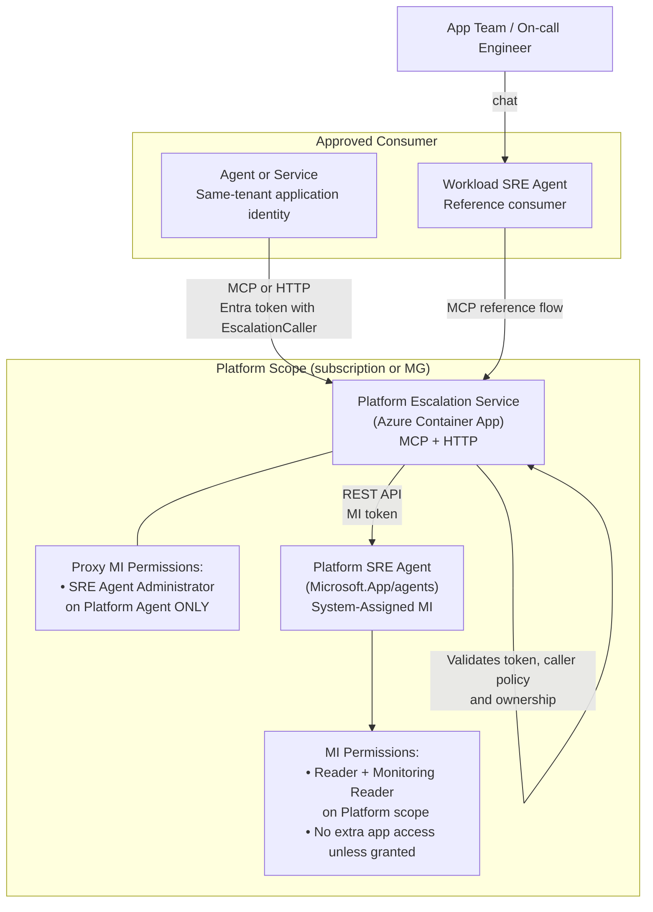
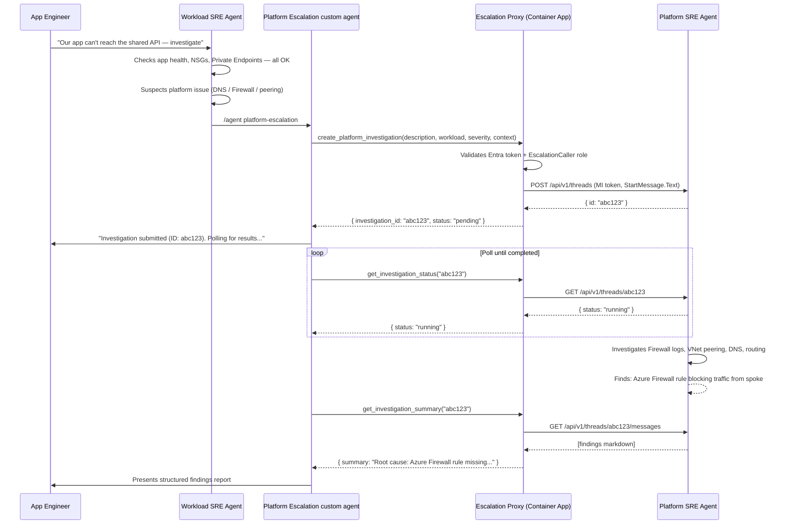
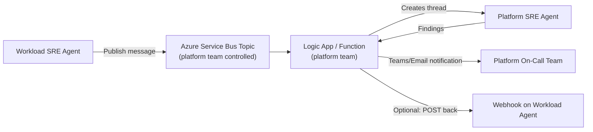

# Architecture: Platform Escalation Service

## Overview

This project implements a Platform Escalation Service aligned to Azure Landing
Zones (ALZ). The service gives approved same-tenant application identities a
narrow investigation-only path to a privileged Platform SRE Agent without
granting them platform-administration access.

The workload SRE Agent is a reference consumer of this service, not a required
component. Any approved caller can use the versioned HTTP or MCP contracts.

The recommended production model uses separate platform and workload subscriptions,
often with management-group-scoped RBAC for the platform agent. For test or lab
scenarios, the same pattern can be deployed inside a single subscription by separating
platform and workload resources into different resource groups and keeping RBAC scoped tightly.

---

## Architecture Diagram



---

## Reference Workload Flow



---

## RBAC Boundaries

| Identity | Role | Scope | Rationale |
|---|---|---|---|
| Platform SRE Agent MI | Reader | Platform management group **or** platform subscription | Read all platform resources |
| Platform SRE Agent MI | Monitoring Reader | Platform management group **or** platform subscription | Read logs, metrics, alerts |
| Platform SRE Agent MI | *ideally no assignment* | Workload application scopes | Keep workload isolation where possible |
| Escalation Proxy MI | SRE Agent Administrator | Platform SRE Agent resource only | Data-plane access to create/read threads |
| Escalation Proxy MI | *no other assignments* | Anywhere else | Minimal privilege |
| Workload SRE Agent MI | Reader | Own workload subscription or resource-group scope | Read own app resources |
| Workload SRE Agent MI | Monitoring Reader | Own workload subscription or resource-group scope | Read own monitoring data |
| Workload SRE Agent MI | EscalationCaller (Entra app role) | Proxy Entra app registration | Can call proxy — not platform agent directly |

---

## Sample ALZ Landing Zone Alignment

The service does not require a particular management-group hierarchy, network topology,
firewall product, or DNS architecture. The following is one supported production example
for organizations using an ALZ hub-and-spoke model. Platform owners should adapt the
[sample investigation playbook](./alz-hub-spoke-playbook.md) to their verified environment.

Example production topology:

```
Tenant Root
└── Management Group Hierarchy
    ├── Platform (mg-platform)
    │   ├── Management Subscription      ← Platform SRE Agent + Escalation Proxy deployed here
    │   ├── Connectivity Subscription    ← Platform Agent MI has Reader here (hub VNet, Firewall)
    │   └── Identity Subscription        ← Platform Agent MI has Reader here (DC, ADDS)
    └── Landing Zones (mg-landingzones)
        └── Corp / Online / ...
            └── <App Team Subscription>  ← Workload SRE Agent deployed here
                ← Platform Agent normally has NO access here
                ← Workload Agent has Reader on this sub only
```

Single-subscription test variant:

```
Shared Subscription
├── rg-sre-platform        ← Platform SRE Agent + Escalation Proxy
├── rg-network-shared      ← Hub VNet, Firewall, DNS, shared services
└── rg-app-team-a          ← Workload SRE Agent + workload resources

Platform Agent RBAC: Reader + Monitoring Reader on the shared subscription
Workload Agent RBAC: Reader + Monitoring Reader on its workload resource groups
```

---

## Security Rationale: Why the Proxy Pattern?

Direct `SRE Agent Administrator` assignment on the platform agent would allow workload agents to:
- Read all platform agent memories (potentially containing sensitive topology info)
- Create scheduled tasks on the platform agent
- Modify skills and hooks
- Access all investigation threads (including those from other workload teams)
- Delete and recreate agent components

The proxy pattern limits workload agents to **3 specific, read-plus-create operations** on the platform agent,
and the platform team controls who gets access through a single Entra app role assignment.

---

## Alternative: Event-Driven Escalation (Async, No Real-Time Result)

For teams that prefer fully decoupled, non-real-time escalation (e.g. for lower severity or batch investigations):



**Trade-offs:**
- ✅ Fully decoupled — no synchronous dependency on proxy availability
- ✅ Natural approval gate (platform team can triage before investigation starts)
- ❌ No real-time result in the workload agent thread — engineer must check separately
- ❌ More moving parts (Service Bus + Logic App in addition to SRE agents)

---

## Project Structure

```
sre-agent-team/
├── modules/           Reusable Bicep modules (sre-agent, rbac, mcp-connector)
├── platform/          Platform SRE Agent deployment + custom agents
├── escalation-proxy/  Python MCP proxy app + Container App infrastructure
├── workload/          Workload SRE Agent template + custom agents
├── scripts/           Deployment PowerShell scripts
└── docs/              This file
```
