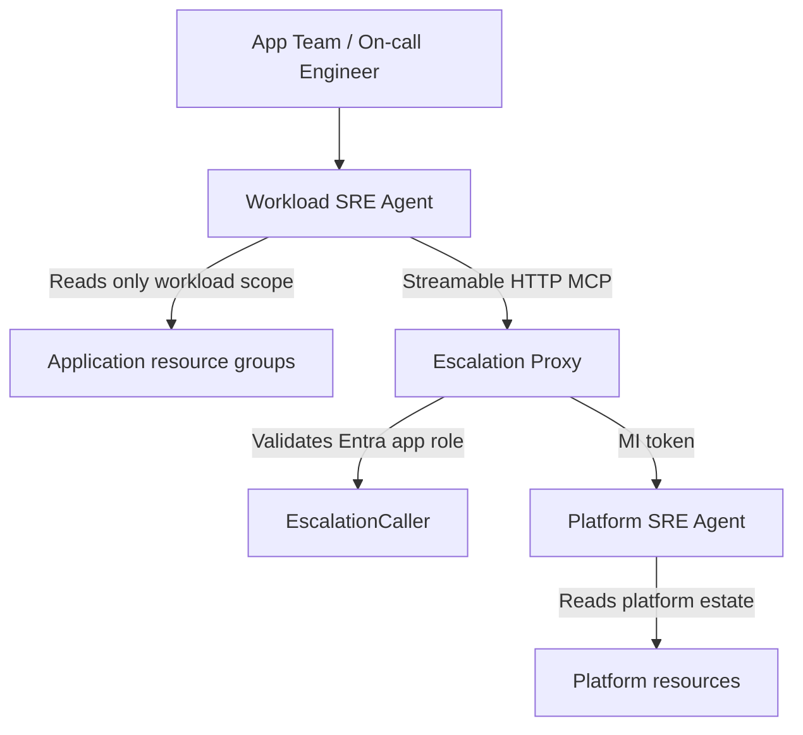

# Detailed Specification and Implementation Plan

## Document status

- Status: Historical design reference; implementation status is superseded by [plan.md](./plan.md)
- Scope: Platform + workload SRE agent architecture, escalation proxy, RBAC model, deployment automation, and implementation guidance
- Audience: Platform engineering, application teams, operations owners, and future contributors revisiting the design

The status checklist below captures an earlier design stage and is retained for
historical rationale only. Do not use it to determine current deployment readiness.

---

## Current implementation status

This section tracks what is already implemented versus what remains to be completed or validated in the repository.

### Done

- Platform SRE agent Bicep deployment pattern is defined and documented in [platform/main.bicep](../platform/main.bicep)
- Workload SRE agent deployment pattern is defined and documented in [workload/main.bicep](../workload/main.bicep)
- Reusable infrastructure modules for the agent, RBAC assignment, and MCP connector are in place under [modules](../modules)
- The escalation proxy app and infrastructure are present under [escalation-proxy](../escalation-proxy)
- Deployment scripts for platform, proxy, workload, and grant flows are present under [scripts](../scripts)
- Repository README explains the broader architecture and deployment flow
- Initial architecture narrative and RBAC rationale are documented in [docs/architecture.md](./architecture.md)

### In progress / partially implemented

- Some deployment details depend on Azure environment-specific values and state handoff files
- Script-driven multi-phase deployment is implemented, but full production validation still depends on targeted environment testing
- Custom agent upload behavior should be validated in a real environment to confirm runtime compatibility with the selected agent configuration

### Not yet complete / pending validation

- End-to-end smoke test of workload → proxy → platform escalation flow
- Verification of RBAC and Entra app-role assignments against a live tenant setup
- Production-grade validation of proxy health, logging, and failure handling
- Confirmation of the exact runtime behavior of Azure MCP connector auth settings across environments
- Full review of network and security constraints for private-only or management-group-scoped production deployments
- Documentation of runbooks for operational ownership and incident response

### Known risks / assumptions

- This repo assumes a functional Azure tenant, deployment identity, and proper subscription permissions
- The platform and workload separation is enforced by design, but final enforcement depends on actual RBAC assignment and environment governance
- Some product behavior may vary by tenant or portal runtime version, especially for custom agent and connector configuration details

### Recommended next milestone

- Complete one end-to-end test deployment in a non-production validation environment
- Verify that the platform agent, proxy, and workload agent can all communicate as intended
- Capture any environment-specific configuration drift and then finalize operational documentation

---

## 1. Purpose and problem statement

This repository implements a secure, production-oriented Azure SRE agent design that separates responsibilities between a platform team and application teams while keeping an operational path for assisted triage and escalation.

The core problem is that application teams typically need read-only operational context for their own workloads, but they should not be allowed to directly manipulate or inspect the central platform agent used by the platform SRE team. At the same time, platform teams need a controlled way to receive escalations and investigate platform issues without opening broad lateral access.

This design addresses that problem by using:

- A workload SRE agent scoped to a specific application or resource group set
- A dedicated escalation proxy that enforces a narrow tool contract
- A central platform SRE agent owned by the platform team
- Explicit RBAC boundaries and Entra-based authorization

The system is intentionally designed around least privilege, clear separation of duties, and auditable escalation paths.

---

## 2. Goals

### Primary goals

1. Enable application teams to investigate their own workload issues with a scoped SRE agent.
2. Allow the workload agent to escalate to the platform agent through a tightly controlled proxy.
3. Prevent direct workload-to-platform access escalation outside the approved workflow.
4. Make the deployment repeatable and suitable for Azure Landing Zones (ALZ) patterns.
5. Keep operational security, observability, and auditability as first-class concerns.

### Secondary goals

- Support both single-subscription lab environments and multi-subscription production patterns.
- Allow custom agent definitions to be deployed as part of the platform and workload setup.
- Keep the architecture flexible enough for future expansion, such as additional tools, workflow steps, or service-specific integrations.
- Produce a deployable IaC and script-driven workflow that is simple to operate by teams.

---

## 3. Non-goals

This solution does not aim to:

- Be a general-purpose enterprise chatbot platform
- Represent a universal Azure access model for all identities
- Replace formal Azure RBAC governance or platform approval processes
- Provide a centralized source of truth for application permissions
- Implement arbitrary platform automation outside the approved MCP and investigation workflow

The repository is for deployment wiring and access flow, not for authoritative enterprise authorization policy.

---

## 4. High-level architecture

### Overview

The solution follows a two-tier design:

- Workload SRE Agent: deployed in an app team subscription or workload landing zone
- Platform SRE Agent: deployed in the platform subscription or platform management group scope
- Escalation Proxy: acts as the only permitted bridge between the two

### Logical flow

### Trust boundaries

There are three distinct trust boundaries in the design:

1. Workload trust boundary
   - Agent is scoped to application resources only
   - Read-only access to app team-owned resource groups
   - No direct permission to platform agent

2. Proxy trust boundary
   - All escalations must pass through the proxy
   - Proxy validates the caller identity and app role
   - Proxy executes a very small set of allowed operations

3. Platform trust boundary
   - Platform SRE agent is allowed to inspect the platform estate
   - It is not directly exposed to workload identities

---

## 5. Actors and responsibilities

### Platform team

The platform team owns:

- The platform SRE agent
- The escalation proxy
- The platform-side investigation workflow
- RBAC design and approval boundaries for the platform-managed estate
- Custom agents or platform automation used for investigation execution

### Application team

The application team owns:

- The workload SRE agent
- The resource groups and resources the agent is permitted to inspect
- Their operational context and escalation triggers
- Workload-specific troubleshooting and diagnosis routines

### Central operations / platform owner

The platform owner or centralized ops function is responsible for:

- Reviewing the approved escalation pattern
- Ensuring the platform SRE agent remains isolated
- Approving role assignments and network/security constraints for production deployments

---

## 6. Functional requirements

### FR-01: Workload scoping

The workload SRE agent must be deployable with explicit scope to one or more workload resource groups. It must not be granted broad or cross-estate access by default.

### FR-02: Platform isolation

The platform SRE agent must not be directly callable by workload identities. All cross-team escalation must go through the proxy.

### FR-03: Narrow tool contract

The escalation proxy must implement only a minimal, explicit tool set:

- create_platform_investigation
- get_investigation_status
- get_investigation_summary

These tools must be the only platform-facing methods available to a workload agent over the MCP connector path.

### FR-04: Entra-backed authorization

The proxy must validate an incoming bearer token containing an allowed Entra app role or equivalent identity claim before acting on a request.

### FR-05: RBAC on platform agent must be least privilege

The proxy identity must hold the minimum platform-side permission required to create and read investigation threads on the platform agent. It must not be granted additional broad access outside the targeted platform agent boundary.

### FR-06: Repeatable deployment

The project must support repeatable Azure deployment using Bicep modules and PowerShell wrapper scripts.

### FR-07: Custom agent upload

The custom workload and platform agents must be provisioned after the core agent resource exists. The deployment scripts must support assigning those data-plane artifacts reliably.

### FR-08: Observability

The design must emit operational logs, telemetry, and investigation metadata suitable for diagnosing failures and validating usage patterns.

### FR-09: Multi-environment support

The project should support:

- single subscription / lab scenarios
- platform subscription + workload subscription topology
- management-group-scoped platform RBAC options for production

### FR-10: Safe redeployment

Redeployments should not fail because of RBAC or identity recreation issues. The escalation proxy must ensure identity-based role assignments are created or repaired as part of deployment.

---

## 7. Non-functional requirements

### Security

- Principle of least privilege must be applied to all role assignments.
- Secrets must not be stored in the connector configuration.
- Token acquisition should rely on managed identity and Microsoft Entra authentication patterns.
- Public exposure must be minimized through Azure security controls and network boundaries.

### Reliability

- The workload agent should continue to function when platform-side investigation is delayed or unavailable.
- Investigation state should be observable via status polling and summary retrieval.
- Proxy operations should fail safely and return clear status information.

### Operability

- Deployment scripts should be understandable and repeatable.
- Resources should be named consistently and tagged appropriately.
- State should be captured between deployment phases to avoid brittle manual wiring.

### Maintainability

- Core Azure resources should be represented as reusable Bicep modules.
- Platform and workload deployment scripts should remain separate and composable.
- The escalation proxy registry abstraction should allow future replacement of storage backends without changing request handlers.

---

## 8. Detailed component specification

### 8.1 Platform SRE Agent

#### Purpose

The platform SRE agent is the central investigation plane used by platform operators to analyze broad platform issues, connectivity problems, DNS, networking, resource health, and other shared-environment concerns.

#### Scope

- Managed by the platform team
- Installed in the management or platform subscription
- Typically granted Reader + Monitoring Reader on platform estates
- Not intended for direct app-team operational access

#### Deployment model

The platform SRE agent is deployed through the Bicep module at:

- `platform/main.bicep`
- `modules/sre-agent.bicep`

This deployment creates:

- the agent resource
- its system-assigned managed identity
- its user-assigned managed identity
- the application insights integration when enabled

#### RBAC intent

The platform SRE agent should be assigned read-level permissions to the platform scope only, with scope aligned to the intended platform ownership model.

---

### 8.2 Workload SRE Agent

#### Purpose

The workload SRE agent is the operational assistant for an application or workload boundary. It is purpose-built to inspect only the resources relevant to that workload.

#### Scope

- Bound to a resource group list or workload scope
- Read-only monitoring and inspection access within those resource groups
- Ability to call the escalation proxy only, not the platform agent directly

#### Deployment model

The workload SRE agent is provisioned through:

- `workload/main.bicep`
- `modules/sre-agent.bicep`

It creates a connector to the escalation proxy using the streamable-HTTP MCP connector pattern and binds that connector to the workload agent's own identity.

#### Required inputs

- `agentName`
- `location`
- `workloadDisplayName`
- `scopedResourceGroups`
- `escalationProxyEndpointUrl`
- `escalationProxyEntraClientId`
- `escalationConnectorAuthType`
- `enableApplicationInsights`

#### Outputs

- `agentId`
- `principalId`
- `uamiPrincipalId`
- `grantEscalationCommand`
- `applicationInsightsId`

---

### 8.3 Escalation proxy

#### Purpose

The escalation proxy is the controlling service that prevents workload agents from directly obtaining broad access to the platform SRE agent.

#### Exposed operations

The proxy intentionally exposes exactly three MCP tools:

1. create_platform_investigation
   - Creates a new thread or investigation on the platform agent
   - Accepts workload metadata, issue context, severity, and investigation inputs

2. get_investigation_status
   - Returns the platform investigation state using the investigation ID

3. get_investigation_summary
   - Returns end-of-investigation findings, summary text, and metadata

#### Security requirements

- Only authenticated callers with an allowed app role can use the model
- Proxy identity is treated as a platform-controlled service principal
- Each request is checked against the intended role and execution context
- The proxy validates and normalizes the request before invoking the platform SRE agent

#### Storage and registry

The project supports a registry abstraction. The current design allows either:

- memory backend for local testing
- Azure Table Storage backend for production-like deployment

The registry stores investigation metadata including:

- investigation ID
- workload identifier
- thread or message reference
- status
- timestamps
- owner metadata
- summary output

---

## 9. Security model

### 9.1 Trusted identity model

| Identity | Trusted For | Permission Boundary |
|---|---|---|
| Workload SRE Agent MI | Workload diagnostics | Only app-owned resource groups |
| Workload agent user-assigned MI | Connector and action execution | Same as workload scope |
| Escalation Proxy MI | Platform investigation execution | Only platform agent resource boundary |
| Platform SRE Agent MI | Platform investigation work | Platform scope |
| Entra app role holder | Proxy access | Controlled by the proxy app registration |

### 9.2 Why the proxy pattern is required

Direct permissioning of workload identities on the platform agent introduces several risks:

- cross-workload data exposure
- broader thread access than intended
- ability to modify or create unauthorized agent operations
- sensitive platform topological information leakage
- auditing confusion across product boundaries

The proxy narrows the risk model to a three-operation contract and keeps the platform-side trust boundary explicit.

### 9.3 Threat considerations

This design addresses the main concerns:

- identity spoofing through Entra token validation
- role drift through RBAC governance
- excessive access via resource-group scoping and separate subscriptions
- unauthorized use of platform investigation operations by requiring explicit role checks
- log and telemetry leakage by reducing broad direct agent access

---

## 10. Deployment architecture and workflow

### 10.1 Required components

The deployment workflow creates the following primary artifacts:

- Platform agent resource
- Platform custom agents
- Workload agent resource
- Workload custom agent definitions
- Escalation proxy Azure Container App
- Managed identities and RBAC assignments
- ACR integration for proxy image build/push
- Optionally Application Insights resources and connections

### 10.2 Script-driven phases

The repository includes sequential deployment scripts:

1. `scripts/deploy-platform.ps1`
2. `scripts/initialize-escalation-proxy-entra.ps1` (one-time privileged bootstrap)
3. `scripts/deploy-escalation-proxy.ps1`
4. `scripts/deploy-workload.ps1`
5. `scripts/grant-workload-escalation.ps1`
6. `scripts/deploy-all.ps1`

These scripts coordinate through a deployment state file saved under `scripts/.deploy-state.json` so outputs can flow between phases without repetitive manual copying.

### 10.3 Recommended operating model

#### Production pattern

- Platform team deploys platform agent and proxy
- Platform team assigns read access at management-group or platform subscription scope
- Application team deploys workload agent with scope limited to their RGs
- Platform team grants the workload identity the Entra app role for the proxy

#### Lab or single-subscription test pattern

- Deploy both services in the same subscription
- Keep separate resource groups for the platform and workload boundaries
- Use tighter resource-group-level RBAC rather than broad management-group scope

---

## 11. Implementation specifics

### 11.1 Core IaC modules

#### `modules/sre-agent.bicep`

Responsibilities:

- deploy the Microsoft.App/agents resource
- configure managed identities
- configure Application Insights if enabled
- expose identity outputs and endpoint metadata
- support the underlying agent runtime and action model

#### `modules/rbac-assignments.bicep`

Responsibilities:

- create role assignments for a principal at a given scope
- attach a readable role description for traceability
- allow repeatable assignment for the system-assigned and user-assigned identities

#### `modules/mcp-connector-streamable-http.bicep`

Responsibilities:

- configure an MCP connector to a streamable HTTP endpoint
- bind authentication model and audience values
- configure the proper identity against which the connector authenticates

---

### 11.2 Platform deployment behavior

The platform deployment:

- creates the platform agent
- assigns default read permissions to its resource group
- optionally applies management-group-scoped RBAC if a platform management group ID is supplied
- stores deployment outputs needed by the proxy and workload stages
- uploads custom agent definitions relevant to the platform workflow

---

### 11.3 Workload deployment behavior

The workload deployment:

- creates the workload agent resource
- assigns Reader and Monitoring Reader roles to each declared workload resource group for both system and user-assigned identities
- creates the MCP connector pointing to the escalation proxy
- configures the Entra app client ID audience/scope
- emits the exact grant command needed by the platform team

---

### 11.4 Proxy deployment behavior

The proxy deployment:

- builds or references the proxy application image
- consumes an existing proxy Entra application client ID without Microsoft Graph access
- configures the container app with the required identity and environment settings
- assigns the required role to the proxy’s managed identity on the platform agent
- sets up application insights and operational logging
- validates the configuration needed for the workflow

---

## 12. Data and API contract details

### 12.1 MCP tool contract

The proxy provides the following semantic contract for workload-to-platform requests:

#### create_platform_investigation

Request fields:

- workload_name
- workload_scope
- description
- severity
- context
- source_identity
- optional metadata

Response fields:

- investigation_id
- status
- created_at
- message

#### get_investigation_status

Request fields:

- investigation_id

Response fields:

- investigation_id
- status
- updated_at
- progress_summary

#### get_investigation_summary

Request fields:

- investigation_id

Response fields:

- investigation_id
- status
- summary
- schema_version
- completed_at

### 12.2 Operational metadata requirements

Each investigation record should include enough metadata to support future review:

- time of creation
- changed time
- requestor identity
- workload identifier
- investigation ID
- status state
- summary or final conclusion
- error or failure reason if applicable

---

## 13. Observability and operations

### Telemetry requirements

This solution should produce operational telemetry in at least the following areas:

- proxy request count and success/failure rate
- authorization failures
- platform investigation creation and completion durations
- role assignment or permission issues
- container app health
- agent runtime errors or platform-side API failures

### Logging expectations

Logs should capture:

- request timestamps
- caller principal metadata
- workload identifier
- proxy tool invoked
- platform agent thread identifier
- investigation status changes
- redacted summary payloads

### Operational tasks

Planned operational procedures include:

- verify platform deployment succeeded
- verify proxy health and connectivity
- verify workload connector is in place
- verify custom agents are uploaded
- verify platform and workload identities have the required RBAC
- verify escalation flow with a test scenario

---

## 14. Testing strategy

### Unit and behavioral checks

- Validate deployment parameter parsing
- Validate role assignment modules for both system and user-assigned identities
- Validate the proxy tool contract and request validation logic
- Validate summary redaction for credential-like content

### Integration checks

- Deploy platform agent and verify endpoint is reachable
- Deploy escalation proxy and confirm container health
- Deploy workload agent and validate the connector config
- Simulate a workload escalation request
- Confirm platform investigation is created and summary retrieved properly

### Acceptance checks

The implementation is considered good when the following are true:

- Workload agent cannot directly access the platform agent
- Proxy is the only path for escalation requests
- Investigations can be created, polled, and summarized end-to-end
- RBAC is scoped and auditable
- Deployment scripts can be rerun without breaking the environment unnecessarily

---

## 15. Risks and open questions

### Current risks

- The success of the workflow depends on correct Entra role configuration and portal-side runtime behavior.
- The production deployment topology requires careful management-group and subscription planning.
- The authorization model is intentionally narrow and may require future extension as new tool types are added.
- App team roles and platform team governance are operational rules, not purely repository rules.

### Open design questions

- Should the proxy eventually support queued or asynchronous investigation flows?
- Should additional audit storage be added for long-term investigation retention?
- Should there be a formal approval workflow for new workload onboarding?
- Should the proxy expose additional guardrails or rate limiting for high-volume workloads?

---

## 16. Implementation roadmap

### Phase 1: Baseline deployment

- Deploy platform agent
- Deploy proxy
- Deploy workload agent
- Validate custom-agent upload

### Phase 2: Security hardening

- Verify role assignment scope
- Validate allowed app role conditions
- Review network and Private Endpoint posture
- Ensure least privilege is preserved

### Phase 3: Observability and operations

- Add strong log review
- Validate status polling and summary retrieval
- Add operational runbooks and owner documentation

### Phase 4: Extension

- Add additional platform tools only if clearly justified
- Add workflow automation for escalations or notifications
- Evaluate event-driven alternatives for lower-severity investigations

---

## 17. Definition of done

This design is complete when the following outcomes are met:

- The platform and workload agent split is documented and operationally clear
- The escalation proxy pattern is enforced as the single authorized path
- Workload scope is explicit and limited
- Deployment automation is repeatable across environments
- Security, auditability, and observability are in place
- Future maintainers can understand the architecture without needing hidden tribal knowledge

---

## 18. Implementation notes for future contributors

When revisiting this repository later, the most important concepts to preserve are:

1. Separation of platform and workload concerns
2. Least privilege RBAC as the guardrail
3. The proxy as the only cross-boundary escalation mechanism
4. Deployment-state handoff via the script automation layer
5. Clear custom-agent lifecycle: create the agent resource first, then upload the data-plane artifacts

These principles are more important than any single deployment script or naming convention.

---

## 19. Recommended next actions

- Review the Bicep modules and confirm deployment inputs match intended environment topology
- Validate the custom agent upload flow in a test environment
- Run a full end-to-end escalation smoke test
- Capture production operations guidance in a concise runbook
- Document any environment-specific policy exceptions or network constraints

This document should be treated as the design baseline for future implementation, troubleshooting, and iteration.
